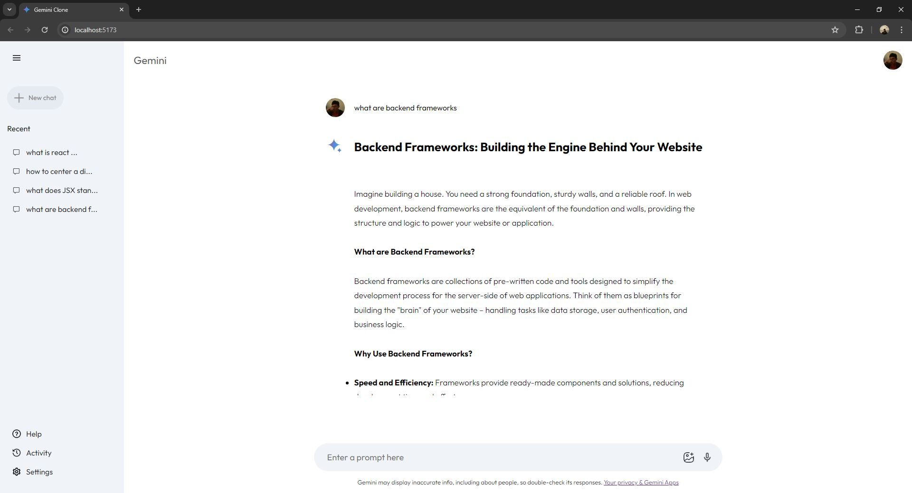

# Gemini Clone with React (Vite) and Gemini API

Built with React (Vite) and integrated with the Gemini API. This project aims to recreate the core features of Google Gemini.

## Screenshots


*Main Interface of Gemini Clone.*


*Prompt and Output.*


## Usage
1. Start the development server:
    ```sh
    npm run dev
    ```
2. Open your browser and go to `http://localhost:5173`.
Alternative: [Vercel](https://gemini-clone-kappa-seven.vercel.app/)

